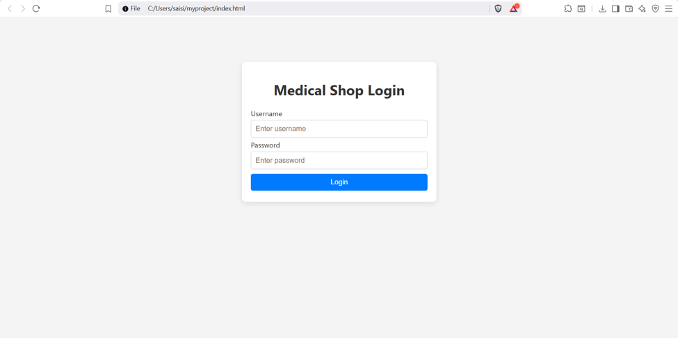
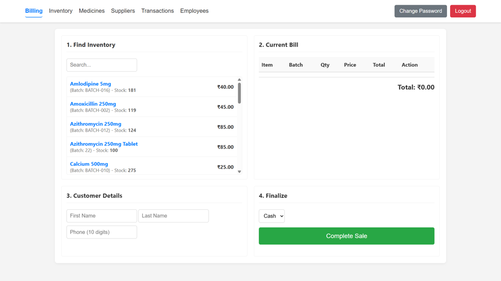
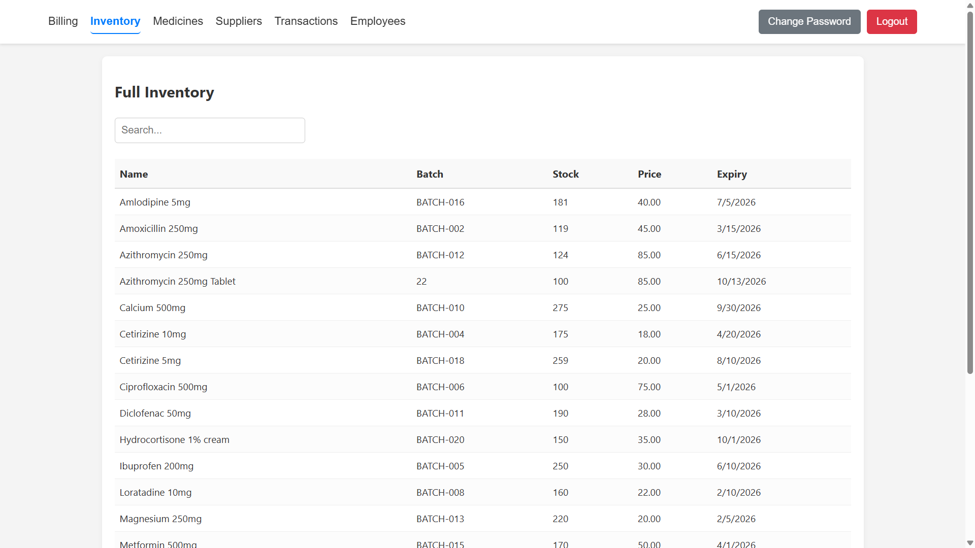
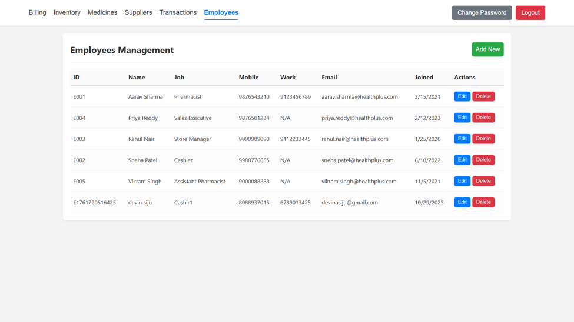

# Medical Shop Management System

An academic coursework project implementing a three-tier Medical Shop Management System using Node.js, Oracle 11g, JavaScript, SQL, and REST APIs.

The system is designed to support the day-to-day operations of a local pharmacy, including medicine inventory management, billing, employee management, supplier/manufacturer information, and transaction records.

---

## 📌 Project Overview

The Medical Shop Management System was developed as a database-driven web application using a three-tier architecture:

- **Frontend:** HTML, CSS, JavaScript
- **Backend:** Node.js with Express
- **Database:** Oracle 11g

The frontend communicates with the Node.js backend through REST-style API endpoints, while the backend manages database operations through Oracle.

The project was developed incrementally using the **Scrum Agile framework**, with functionality delivered across three development sprints.

---

## 🏗️ System Architecture

```text
┌─────────────────────────────┐
│       Frontend              │
│   HTML / CSS / JavaScript   │
└──────────────┬──────────────┘
               │
               │ REST / JSON
               ▼
┌─────────────────────────────┐
│       Backend               │
│     Node.js + Express       │
└──────────────┬──────────────┘
               │
               │ Oracle Driver
               ▼
┌─────────────────────────────┐
│       Database              │
│        Oracle 11g           │
└─────────────────────────────┘

## 📸 Application Screenshots

### Login


### Billing


### Inventory


### Employee Management

